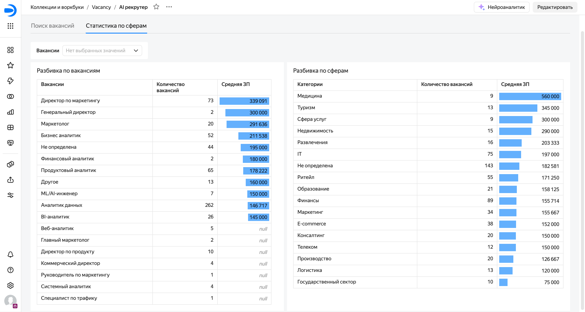

# 📊 Yandex Datalens Dashboard: Аналитика вакансий

Дашборд для визуализации результатов работы ETL-пайплайна по обогащению данных о вакансиях.

## 🎯 Цели дашборда
1. **Анализ** рынка труда по отраслям и должностям
2. **Визуализация** метрик эффективности пайплайна

## 📈 Структура дашборда

### 1. Основные чарты

Распределение по должностям - [vacancy_analysis.sql#L1](./sql_queries/vacancy_analysis.sql#L1)
Распределение по сферам - [vacancy_analysis.sql#L2](./sql_queries/vacancy_analysis.sql#L2)

### 2. Скриншоты

#### Общий вид дашборда


## 🔗 Подключение к данным

### 1. Источник данных
Тип: Yandex Object Storage
Путь: s3://n8n-vacancy-bucket/processed/normalized/
Формат: CSV
Кодировка: UTF-8

### 2. Схема данных
```sql
CREATE TABLE processed.normalized_vacancies (
    id VARCHAR,
    title VARCHAR,
    normalized_title VARCHAR,
    ai_field_of_activity VARCHAR,
    category VARCHAR,
    specialization VARCHAR,
    salary_to DECIMAL,
    created_at DATE,
    _processing_date VARCHAR
);
```
## SQL для анализа
Все SQL запросы доступны в папке sql_queries/

### Пример использования в Datalens:
- Создайте подключение к Object Storage
- Создайте датасет с SQL запросом
- Постройте чарт на основе датасета
- Добавьте на дашборд

Дашборд создан как часть портфолио проекта по ETL обработке данных.